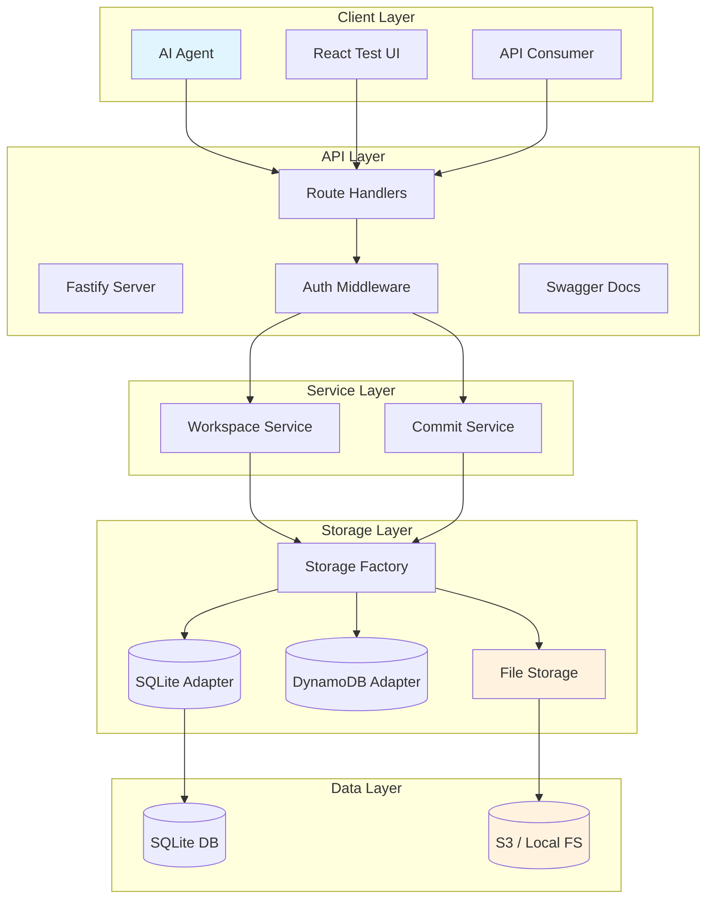
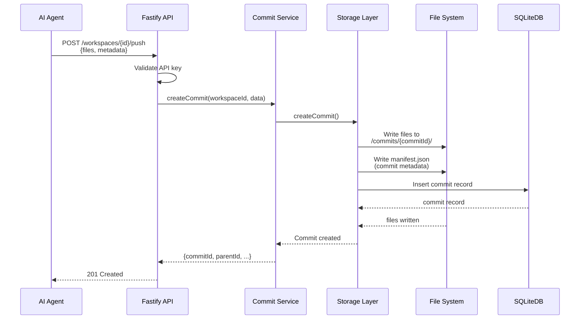
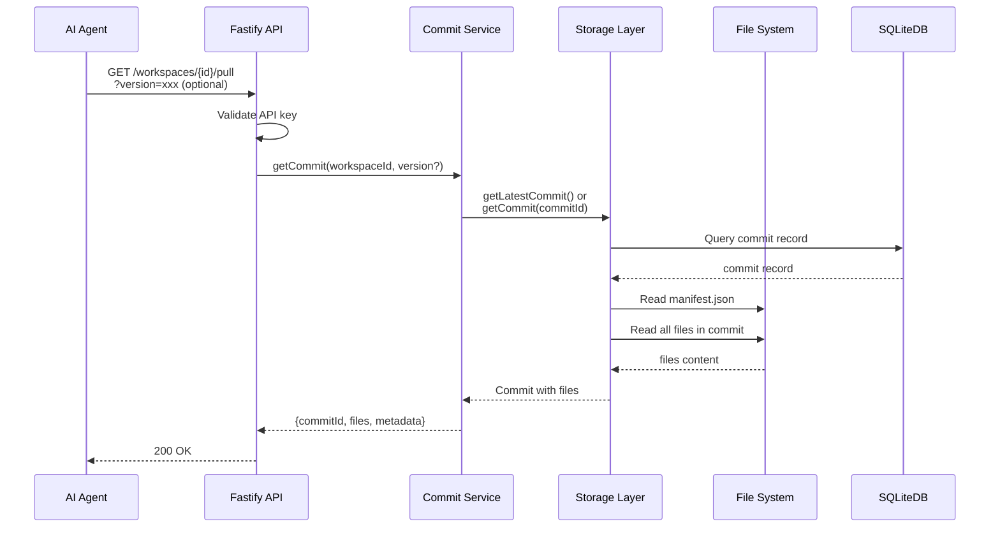
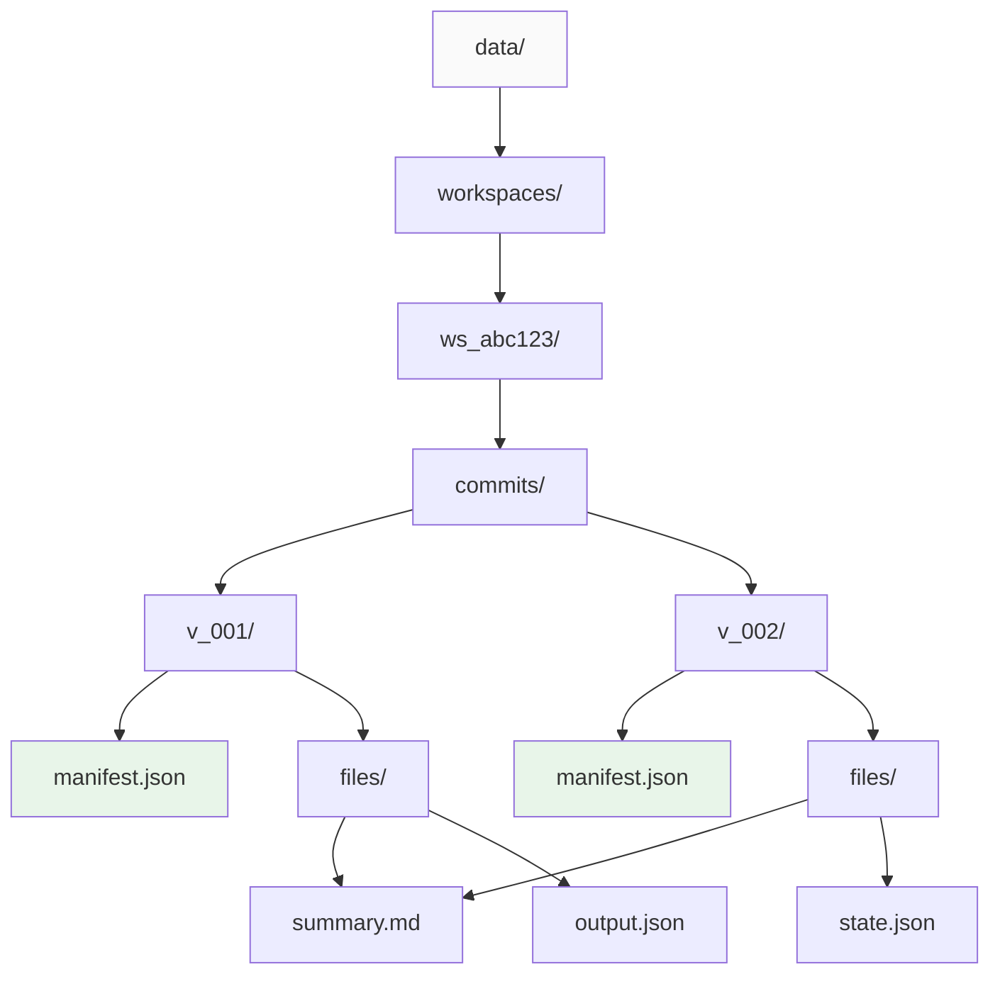
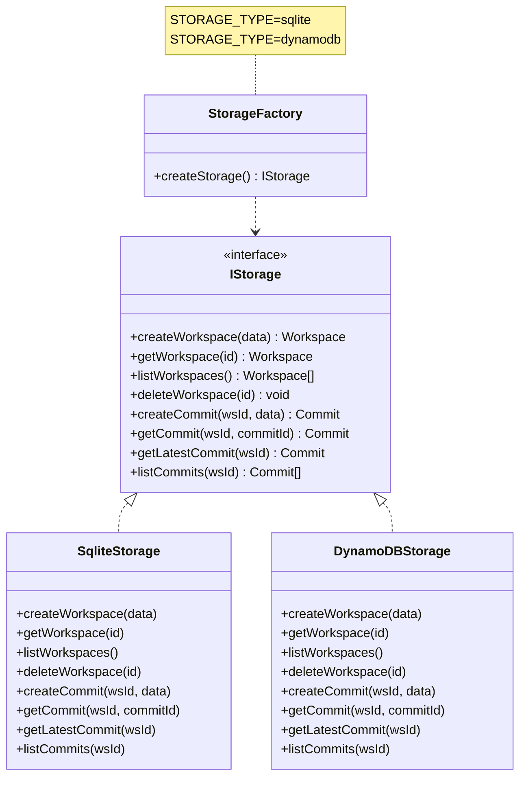
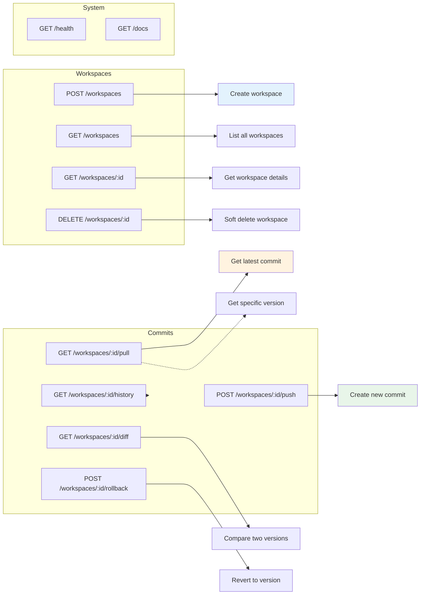
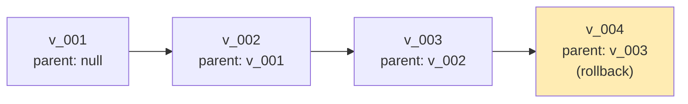
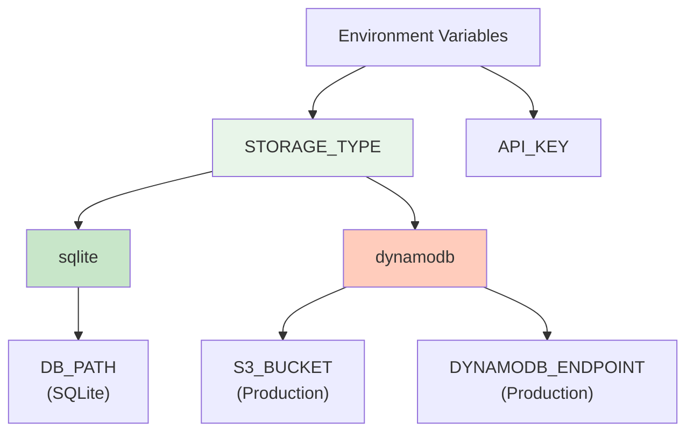
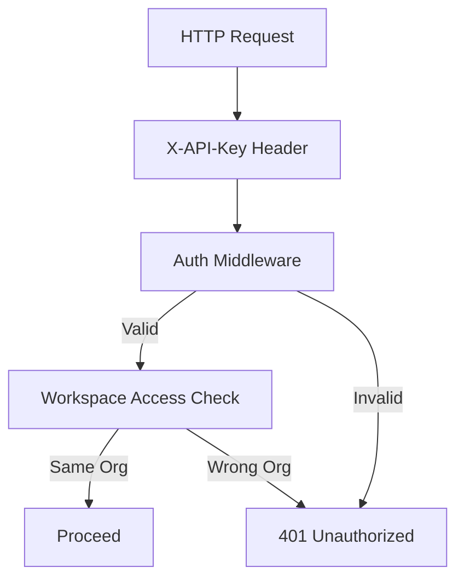

# ContextVault — Architecture

> Multi-tenant, versioned workspace layer for AI agent memory.
> "Git over S3" — versioned file storage for agent context.

---

## System Overview



---

## Data Flow: Push (Agent Saves State)



---

## Data Flow: Pull (Agent Restores State)



---

## Directory Structure (File Storage)



---

## Storage Abstraction Layer



---

## API Endpoints



---

## Manifest Format

Each commit folder contains a `manifest.json`:

```json
{
  "commitId": "v_01KMV8AD9C57X4BE65ZGFC672S",
  "workspaceId": "ws_01KMV8A7Q49R28XN7CHH0TAA8Z",
  "parentId": "v_01KMV8A7Q49R28XN7CHH0TAA8Z",
  "metadata": {
    "agentId": "agent_support_01",
    "taskId": "ticket_123",
    "tags": ["resolved", "customer_a"]
  },
  "sizeBytes": 1024,
  "createdAt": "2026-03-28T14:30:00Z",
  "files": [
    {
      "path": "context/summary.md",
      "content": "# Task Summary\n\nResolved issue..."
    },
    {
      "path": "artifacts/response.json",
      "content": "{\"status\": \"success\"}"
    }
  ]
}
```

---

## Versioning Model (Git-like)



**Key concepts:**
- Each commit has a `parentId` (like git)
- Rollback creates a *new* commit (doesn't destroy history)
- Files stored directly (content-addressable in future)

---

## Why Filesystem + Database?

| Concern | Filesystem | Database |
|---------|------------|----------|
| Agent artifacts (code, outputs) | ✅ Native | ❌ Awkward |
| Version history | ✅ Git-like | ❌ Extra complexity |
| Streaming/binary data | ✅ Native | ⚠️ BLOB needed |
| "List all workspaces" | ❌ Slow scan | ✅ Indexed |
| "Find commits by agent" | ❌ Full scan | ✅ Indexed |
| Simplicity | ✅ Just files | ❌ Schema migrations |

**Current approach:** Filesystem for artifacts + SQLite for metadata index.

**Future:** Could drop SQLite entirely and use a manifest-based approach (filesystem IS the database).

---

## Environment Configuration



---

## Security Model


