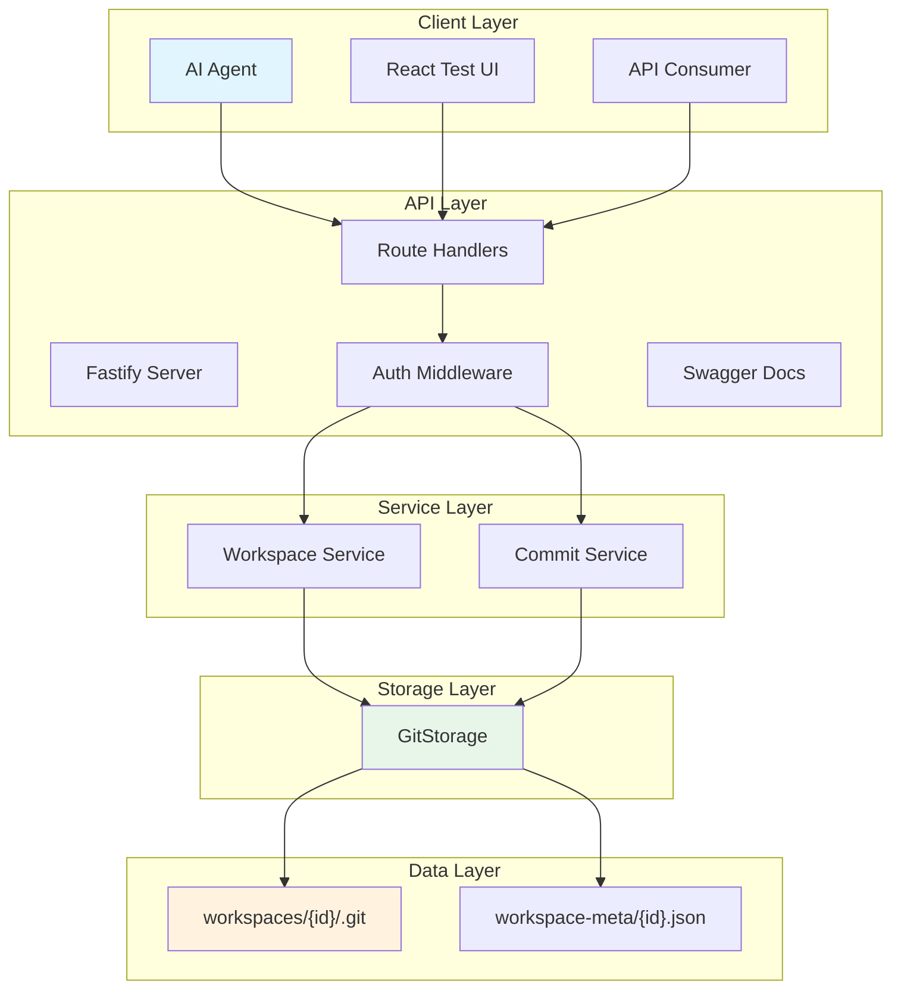
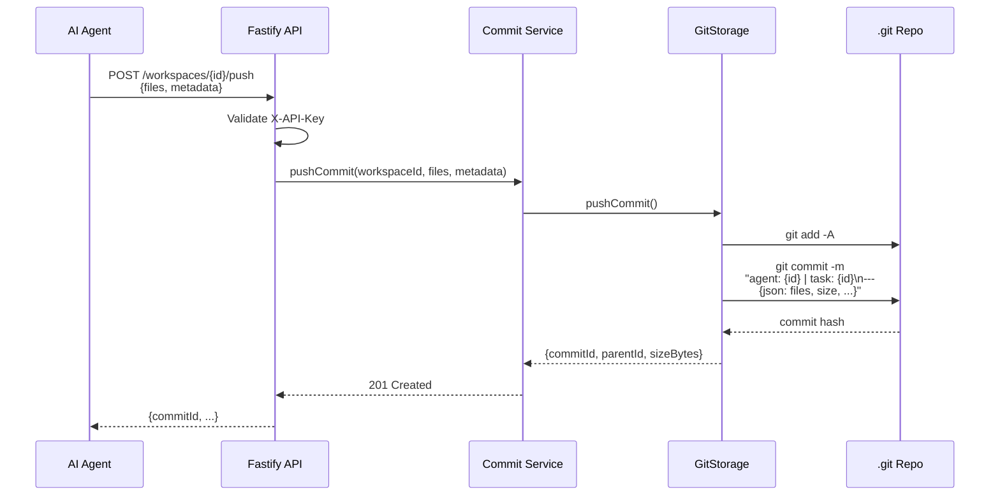
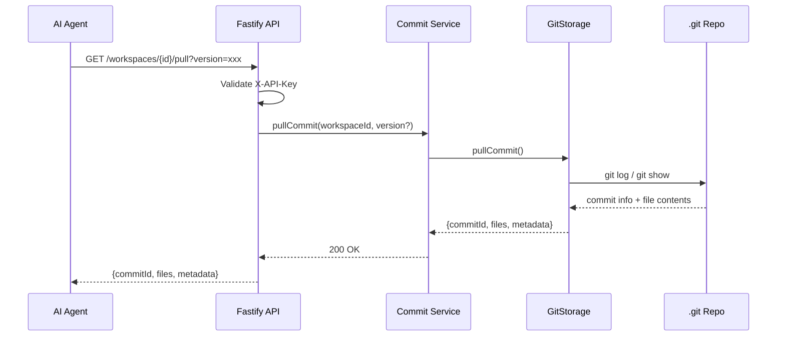
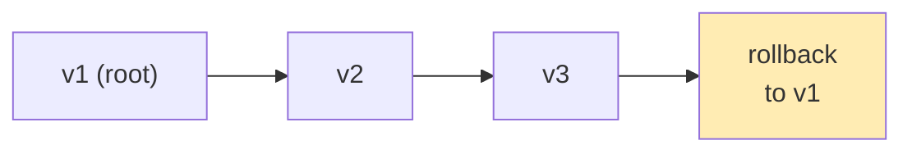
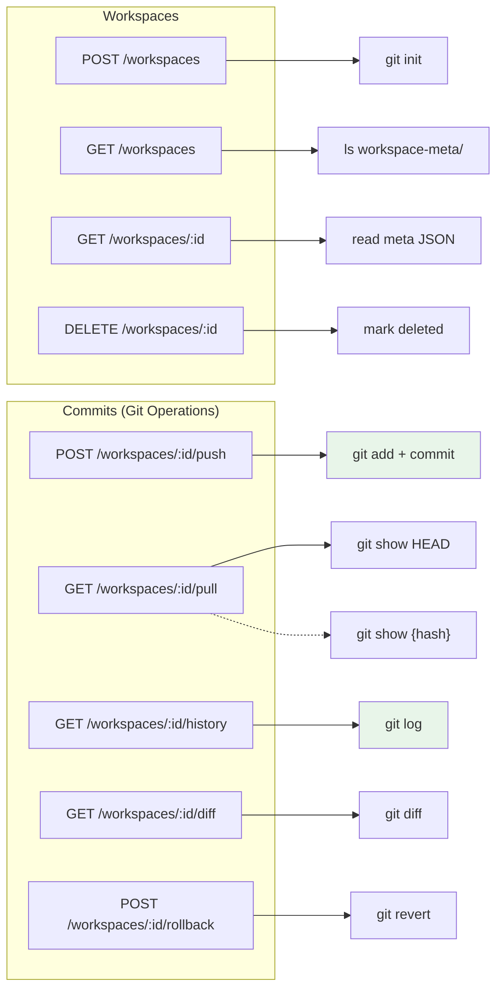
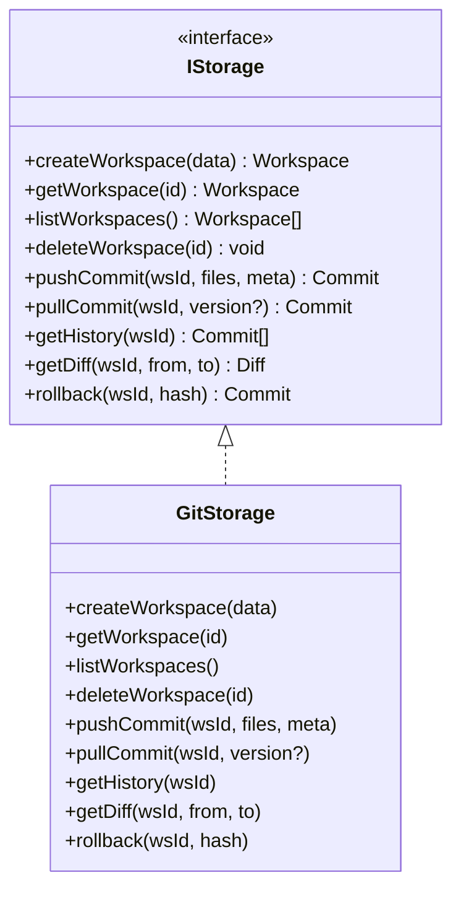
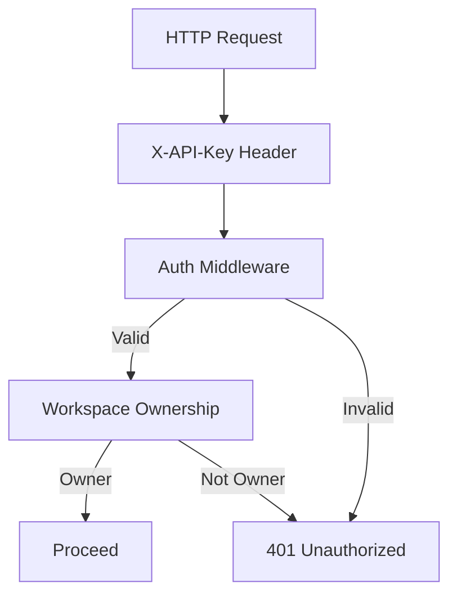

# ContextVault — Architecture

> Multi-tenant, versioned workspace layer for AI agent memory.
> "Git for AI agents" — each workspace is a Git repository.

---

## System Overview



---

## Key Insight: Git-native Storage

Each workspace IS a Git repository. All versioning is handled by Git — no custom commit tracking, no diff logic, no rollbacks to implement.

**Benefits:**
- Battle-tested Git operations (diff, merge, blame, revert)
- Branching for agent experiments
- Standard tool — no proprietary versioning
- Commit messages encode agent metadata

---

## Directory Structure

```
data/
├── workspace-meta/           # JSON files for workspace metadata
│   └── {workspaceId}.json   # (customerId, name, timestamps)
└── workspaces/
    └── {workspaceId}/       # One git repo per workspace
        └── .git/            # Actual Git repository
```

---

## Data Flow: Push (Agent Saves State)



---

## Data Flow: Pull (Agent Restores State)



---

## Commit Message Format

Git commit messages encode agent metadata:

```
agent: agent_123 | task: task_456
---
{"agentId":"agent_123","taskId":"task_456","files":["summary.md"],"sizeBytes":1024}
```

**Parsed on read** to extract metadata without a database.

---

## Versioning Model (Git-native)



**Git handles:**
- Parent pointers
- Full history
- Diff between any two commits
- Revert/rollback creates new commit (preserves history)

---

## API Endpoints



---

## Storage Abstraction



**Current implementation:** GitStorage only (local filesystem)

**Future adapters:** S3-backed Git, GitHub-backed, etc.

---

## Why Git?

| Aspect | Custom Implementation | Git |
|--------|----------------------|-----|
| Diff | Write diff algorithm | `git diff` |
| History | Track commit records | `git log` |
| Rollback | Track reverse changes | `git revert` |
| Branching | Build from scratch | `git branch` |
| Storage | Custom file management | Git handles it |
| Reliability | Unknown | Battle-tested |

---

## Environment Configuration

```bash
# Local development (default)
STORAGE_TYPE=git
DATA_DIR=./data

# Future: Production with S3-backed Git
# STORAGE_TYPE=s3-git
# S3_BUCKET=contextvault-prod
```

---

## Security Model



---

## Verification Checklist

Before claiming a feature works:

- [ ] `npm run build` passes (TypeScript compiles)
- [ ] `npm run dev` starts without errors
- [ ] Create workspace → `.git` folder exists
- [ ] Push → `git log` shows commit with metadata
- [ ] Pull → files returned correctly
- [ ] History → commits parsed with metadata
- [ ] Diff → git diff output matches
- [ ] Rollback → new commit created, old content restored
- [ ] Push to GitHub
